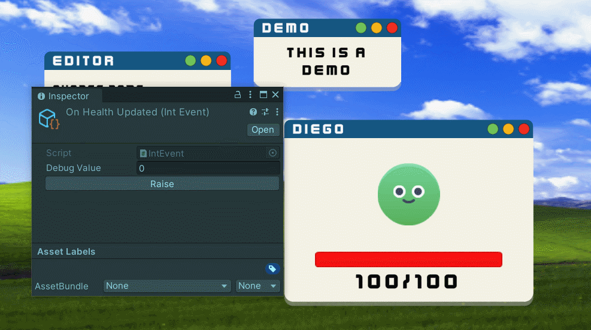
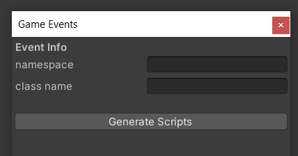

# SO Game Events Architecture

Event system for communication between objects in a Unity scene, based on the use of Scriptable Objects, avoiding classes dependencies. Inspired by Ryan Hipple's talk [Unite Austin 2017 - Game Architecture with Scriptable Objects](https://www.youtube.com/watch?v=raQ3iHhE_Kk)

You can try a demo from this [`itch.io`](https://diegorg64.itch.io/so-game-events-architecture) page, where all the objects from the scene interact with each other without referring to other scripts.

## Table of contents
- [How to install](#how-to-install)
- [How to use](#how-to-use)
    - [Events creation](#events-creation)
    - [Triggering events](#triggering-events)
    - [Events debugging](#events-debugging)
    - [Adding listeners](#adding-listeners)
    - [Listener response from code](#listener-response-from-code)
    - [Create new events types](#create-new-events-types)
- [License](#license)


## How to install
- In Unity, navigate to `Window` -> `Package Manager`
- In the Package Manager Window, click on the `+` sign in the top left corner and click on `Add Package from GIT url`
- Type the repository URL in the text box: `https://github.com/DiegoRuizGil/so-game-events.git`

## How to use

### Events creation
In the `Project` window, right click and nagivate to `Create` -> `Game Events`, and select the event type you want.

The event type indicates the type of data you will send to the listeners subscirbed to it.


### Triggering events
To trigger an event, you'll first requiere a reference to the event in your code. Then, you can use the `Raise` function. This method requires an argument containing the information you want to send to the listeners.

```CSharp
using GameEvents;
using UnityEngine;

public class TestClass : MonoBehaviour
{
    [SerializeField]
    private IntEvent _myIntEvent;

    ...

    private void InvokeMyEvent()
    {
        int value = GetValue();

        if (_myIntEvent != null)
            _myIntEvent.Raise(value);
    }
}
```

### Events debugging
You can trigger an event selecting the scriptable object, setting a `Debug Value` in the insepctor and clicking on the `Raise` button. This will help in debugging whether the listeners are responding correctly to the event, whitout requiring to execute the code needed to trigger it.



### Adding listeners
With a GameObject selected, click on `Add Component` and search for a listener of the same type of the event you want to be suscribed.

In the component, there is an `Game Event` attribute, where you must assing the scriptable object of the event, and a UnityEvent for the `Response`.


### Listener response from code
You can add a response to an event from code. Just take a reference to the listener and use the `AddAction` function to add a new response, or the `RemoveAction` and `RemoveAllActions` functions to remove responses.

```CSharp
using GameEvents;
using UnityEngine;

public class TestClass : MonoBehaviour
{
    private IntListener _listener;

    private void Awake()
    {
        _listener = GetComponent<IntListener>();
    }

    private void OnEnable() => _listener.AddAction(DoSomething);

    private void OnDisable() => _listener.RemoveAction(DoSomething);

    private void DoSomething(int value)
    {
        ...
    }
}
```

### Create new events types
Navigate to `Game Events` -> `Create New Type Event`, from the top bar. In the new menu displayed, you will have to indicate the namespace of the class (if it belongs to one), and the class name.

All the code genereted from this menu will be located in the `CODE_GENERATION` folder inside `Assets`.


 
## License
This project is released under the MIT License by Diego Ruiz Gil (2025)